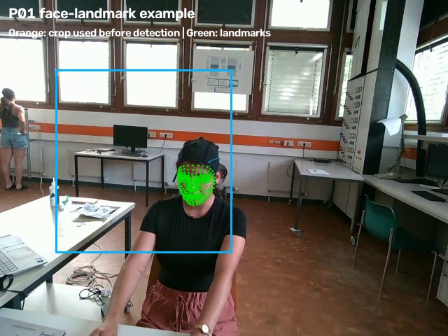
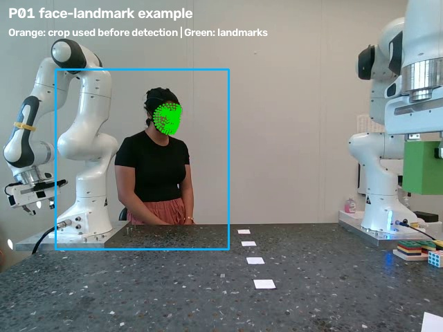
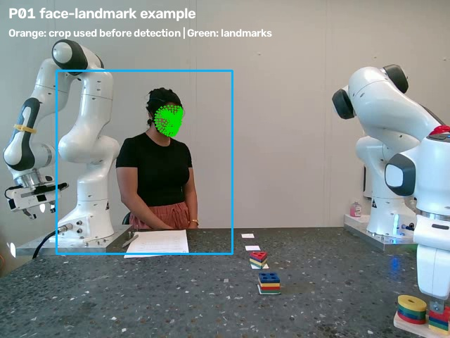
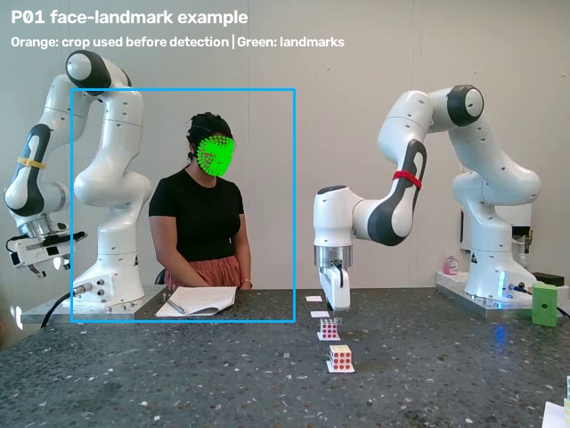
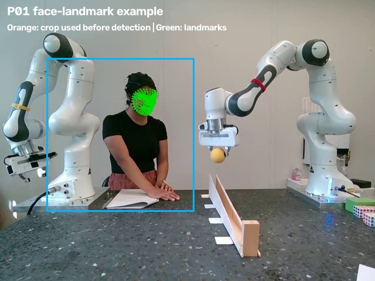
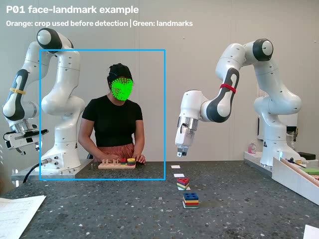
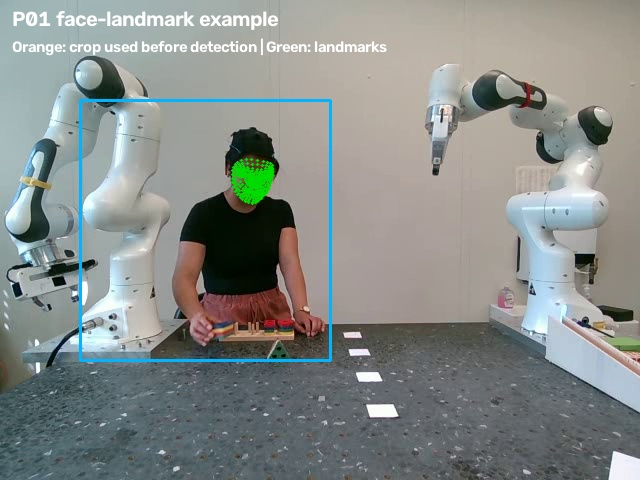

# P01 facial-landmark usability report

## Plain summary

P01's face can be detected in all seven task types when the participant side of the image is cropped and enlarged before landmark detection. The full camera image was not suitable for this detector, even though the face is visible to a person viewing the video.

The percentages below describe sampled video frames, not every original frame. The source usability check sampled every tenth frame (about three frames per second). No raw file was changed.

## How to read stability

Stability is based on how much the detected face width and height change across usable sampled frames. Smaller percentages mean a steadier face size in the image. This is a simple camera-placement check, not a measure of facial expression.

| Experiment | Usable sampled frames | Face-size stability | Result |
|---|---:|---|---|
| Image Experiment (IMAGE_BASELINE) | 2276/2276 (100.0%) | width 0.6%; height 1.4% | usable with the P01 crop |
| Pick and Place (PnP_CONTROL_SLOW) | 101/101 (100.0%) | width 1.0%; height 1.4% | usable with the P01 crop |
| Shape Sorter Observation (SHAPE_CONTROL_FAST) | 155/155 (100.0%) | width 1.7%; height 0.9% | usable with the P01 crop |
| Stack (STACK_FAULTY_FAST) | 186/188 (98.9%) | width 3.0%; height 1.6% | usable with the P01 crop |
| Sisyphus (SISYPHUS_INTERACTION) | 137/137 (100.0%) | width 4.0%; height 4.9% | usable with the P01 crop |
| Shape Sorter Interaction (HRI_INTERACTION) | 217/217 (100.0%) | width 1.6%; height 1.8% | usable with the P01 crop |
| Shape Sorter Alone (SHAPE_ALONE) | 53/53 (100.0%) | width 1.3%; height 2.0% | usable with the P01 crop |

## Example detected frames

The orange rectangle is the fixed P01 crop. Green dots are detected face landmarks. These pictures are new derived files stored outside `data/`.

### Image Experiment



### Pick and Place



### Shape Sorter Observation



### Stack



### Sisyphus



### Shape Sorter Interaction



### Shape Sorter Alone



## What this means

- The P01 robot videos are suitable for a careful landmark-based test after cropping.
- The crop is specific to P01 and must not be assumed to work for other participants without their own check.
- Stack had two sampled frames without a detected face in the three-frames-per-second check. This should be retained as missing landmark data, not filled in.
- The short 13-frame Sisyphus repeat is not used as the task example. The earliest longer Sisyphus recording was used because it is the closest video to the main Sisyphus EEG recording start.

## Proposed processing path

```text
Raw video and vision log (read only)
        ↓
Choose the approved recording run
        ↓
Crop the participant area and enlarge it
        ↓
Convert video colour from BGR to RGB
        ↓
Detect face landmarks
        ↓
Keep detection status and mark failed frames as missing
        ↓
Check face-size stability and remove only clearly unusable windows
        ↓
Calculate approved landmark or facial-geometry features
        ↓
Aggregate features into planned time windows
        ↓
Link to triggers, robot condition, ratings, and EEG only after synchronization checks
```

## Important limits

- Landmark detection does not identify a person's emotional state by itself.
- The robot ratings are condition-level ratings, so they cannot label individual robot events or frames as happy, sad, stressed, or similar states.
- Full facial processing should be run only after the crop rule, run-selection rule, and feature set are approved.
