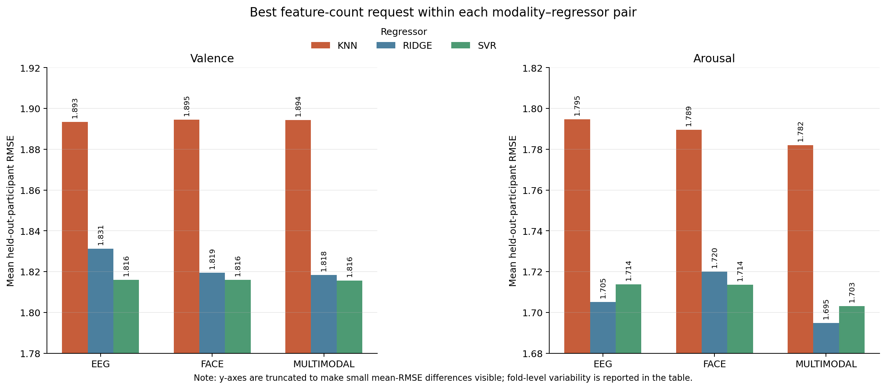
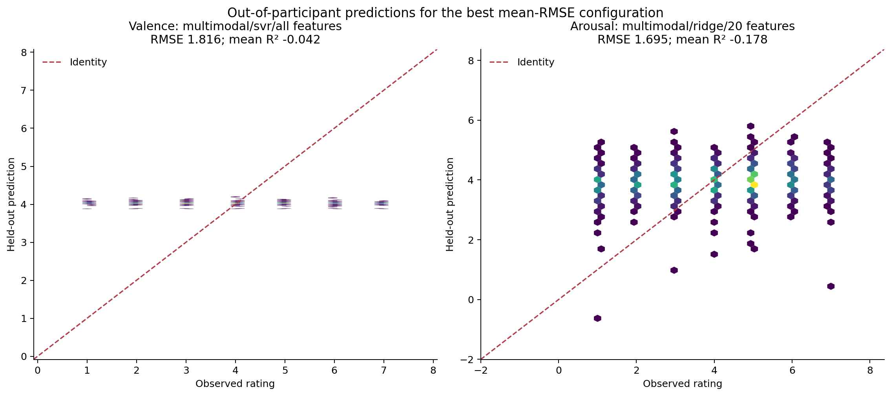
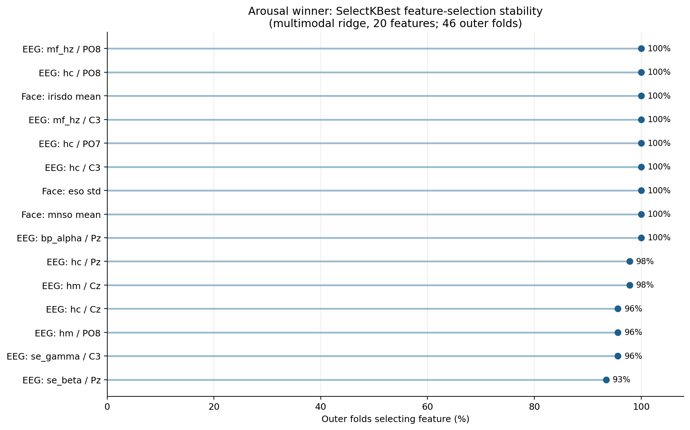

# Stage C general regression: all 46 participants

## Scope

This report summarizes the completed `stage_c_general_regression_all46_v1` run. It evaluates continuous, unconstrained valence and arousal ratings across P01–P46. No models were refit and no raw data were accessed to prepare this report.

For each target, the run evaluated 36 requested configurations: 3 modalities (EEG, face, multimodal) × 3 regressors (KNN, SVR, ridge) × 4 feature-count requests (all, 5, 10, 20). The outer evaluation was leave-one-participant-out (46 folds); hyperparameters were selected separately in the training participants using group-safe inner `GroupKFold` cross-validation and negative RMSE scoring. Predictors were standardized, and `SelectKBest(f_regression)` was fitted inside the pipeline when a finite feature count was requested. The 20-feature request resolves to 10 for face-only models because that modality contains 10 available predictors.

The reported values are means across outer folds. A negative held-out R² means that, within that test participant, the prediction was worse than using the test-fold mean-rating baseline; it has not been clipped.

## Main result

Neither target showed useful across-participant continuous-rating prediction under this evaluation. The lowest mean RMSE configuration had negative mean R² for both valence and arousal, and its explained variance was approximately zero.

| Target | Best configuration | Outer folds | RMSE, mean ± SD | RMSE range | MAE | Mean R² | Mean explained variance |
| --- | --- | ---: | ---: | ---: | ---: | ---: | ---: |
| Valence | Multimodal / RBF SVR / all features | 46 | 1.816 ± 0.341 | 0.814–2.476 | 1.552 | -0.042 | -0.000 |
| Arousal | Multimodal / ridge / 20 features | 46 | 1.695 ± 0.381 | 1.062–2.606 | 1.460 | -0.178 | -0.019 |

For the valence winner, only 2/46 outer folds had positive R². The selected SVR setting was RBF (`C=10`, `epsilon=0.25`, `gamma=0.1`) in 43/46 folds. For the arousal winner, 6/46 outer folds had positive R²; ridge selected `alpha=100` in all 46 folds.

*Figure 1. The bar heights are mean outer-fold RMSE; lower is better. The y-axes are truncated to show the small absolute differences between configurations. Fold-level variability is reported in the table above, rather than by error bars in the chart.*

## Best result within each modality

| Target | Modality | Regressor | Feature request (resolved) | RMSE, mean ± SD | MAE | Mean R² | Mean explained variance |
| --- | --- | --- | --- | ---: | ---: | ---: | ---: |
| Valence | Multimodal | SVR | all (all) | 1.816 ± 0.341 | 1.552 | -0.042 | -0.000 |
| Valence | EEG | SVR | all (all) | 1.816 ± 0.341 | 1.552 | -0.043 | -0.001 |
| Valence | Face | SVR | 10 (10) | 1.816 ± 0.335 | 1.557 | -0.033 | 0.004 |
| Arousal | Multimodal | Ridge | 20 (20) | 1.695 ± 0.381 | 1.460 | -0.178 | -0.019 |
| Arousal | EEG | Ridge | 10 (10) | 1.705 ± 0.409 | 1.469 | -0.195 | -0.016 |
| Arousal | Face | SVR | 5 (5) | 1.714 ± 0.396 | 1.477 | -0.229 | -0.001 |

The modalities are effectively tied for valence: their best RMSE values differ by only 0.000–0.0004. For arousal, multimodal ridge is numerically best, but its margin over EEG ridge is 0.010 RMSE and does not overcome the negative R² result. These rankings should therefore not be interpreted as evidence that one modality is reliably superior.

## Prediction diagnostics

The diagnostic plots pool each configuration's outer-fold predictions. Every point/bin represents a prediction for a participant excluded from that configuration's outer-model fit. The identity line marks perfect calibration.

*Figure 2. The valence winner predicts an extremely narrow range around 4.0 despite observed ratings spanning 1–7. Arousal predictions vary more, but remain weakly aligned with observed ratings. This prediction compression is consistent with near-zero explained variance and negative mean R².*

## Arousal feature-selection stability

The arousal-winning ridge model selected 20 features in each outer-training set. The figure records how often each feature was selected across the 46 outer folds. It describes selection stability conditional on this model-selection procedure; it is not a coefficient magnitude, a test of association, or evidence that a feature is causal.

*Figure 3. Nine features were selected in all 46 folds. The most stable set includes both EEG and face-derived measures, but stable selection did not translate into positive held-out R².*

## Interpretation and limitations

The results do not support a strong claim that the measured EEG, face, or combined features generalize to trial-level continuous valence or arousal prediction in unseen participants. The low explained variance indicates little recovered within-test-fold variation; negative R² also indicates participant-level calibration error relative to the fold-specific mean baseline.

The winner is selected from multiple evaluated configurations, so its minimum RMSE is an optimistic descriptive summary rather than an independent estimate for a pre-specified final model. No permutation testing, statistical comparison between configurations, correction for the configuration search, or external/session-level validation is included. The feature-selection plot should consequently be used for exploratory follow-up only.

For full machine-readable results, see [results_summary.csv](results_summary.csv), [fold_results.csv](fold_results.csv), [predictions.csv](predictions.csv), [best_hyperparameters.csv](best_hyperparameters.csv), and [feature_selection_frequency.csv](feature_selection_frequency.csv). The exact run settings and source-table provenance are retained in [run_manifest.json](run_manifest.json).
